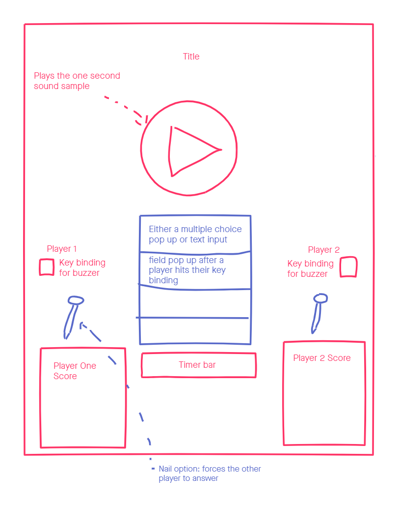

# "Give Me A Second!"
### *A guess-that-tune game for two players*
## Disclaimer
Music included in this project are the rights of their respective owners and I claim no ownership of their recordings.
## Project Overview
For my first project, I had a few ideas for what game I could make. Some were simple and intentionally absurd, while others were a bit over my head in their complexity. What was ultimately decided was a balance between the two extremes: a music trivia game! The concept is a fairly easy one to grasp: one second of a song plays, and you have to guess it before the other player does. 

I wanted to create something simple enough that anyone could play it, equipped with whatever random knowledge of pop music they have. With that in mind, I figured the user interface should follow that philosophy and be very straight forward. I would put in a simple scoreboard with an obvious timer and a giant play button to start the round. But there needed to be more some more complexity too, so I introduced mechanics to give the game more options and interactivity for the players involved, such as a wager mechanic (named nail, paying homage to YDKJ's 'screw mechanic') and a 50/50 mechanic (taking obvious influence from Who Wants To Be Millionaire). 

When I had all the gameplay mechanics and framework in, I spent time to give proper visual feedback for the user, making sure there was input confirmation, as well as visual cues for what to do next. This process took a little longer than anticipated, as it was hard to decide how I should frame the game (landscape? large screen users? mobile?) Ultimately, based on the extent of how much I know about HTML/CSS (not much) and impending time, I decided to have it at least optimized for my laptop that runs a smaller resolution.

I'm happy to say the end result works wells enough, though certainly not the prettiest and a bit crowded, I think it does the job at task very well.

## Wireframes

For The most part, the wireframe goes pretty much to as planned, with the biggest difference in that I opted for a landscape framing that portrait.

## User Stories
* When a user (ideally two) visits the page, they should be greeted with the simple options of either reading the rules or starting a game
* When the user feels ready to begin the game, they should click a button to open the game board up
* The user should get information about their score and power-up abilities for the game.
* When the use is ready to begin a round, they press a play button that would play the sound sample, though no immediately, as to give them time to prepare for it since it is only one second of song that plays
* When a user wants to answer, they should press on their respective key (as explained in the rules but also visually guided to them from the player board), and should get confirmation that they have successfully buzzed in by their box changing color.
* When a user wants to use a powerup, they should see if they are able to use their desired power up
    * If they want to use a nail, they will buzz in and press the nail use, and their opponent's box will change color (though different than the players)
    * if they want to use their 50/50, they will see two options disappear. If they want to select an answer now, they only have two options, all other key inputs will be ignored.
* After each round, points are given. If they player wants to continue, they press the play button again to repeat the process.

## Technologies used
* HTML/CSS: Providing the visual elements and markup.
* JavaScript: Providing the mainframe work of deciding how to shuffle and select songs, see if user selections were right or wrong, calculating scores, providing timers, and keeping track of data in general.
* jQuery/jQueryUI: JS library used extensively to manipulate the DOM, listen for user input, as well as adding effects and animations to DOM elements
* SweetAlert2: Provided some quick alert styles for the end of games
* Google Fonts: Provided main font

## Approaches taken
First, I spent time putting in the framework, made sure the mechanics worked before anything else. This included:
    * Making sure the song database was easy for JS to extract the right information
    * Deciding on a true answer, 3 false answers, and making sure they were all different
This was generally done by using loops that would create and filtering arrays to filter decision making. What was likely the hardest was setting up timers by using promises, which I still don't entirely understand, but after hammering at it, I was able to get it to work.

## Installation guide
Only requirements are:
* Tested to work on 

## Things to Add

## Closing Comments
